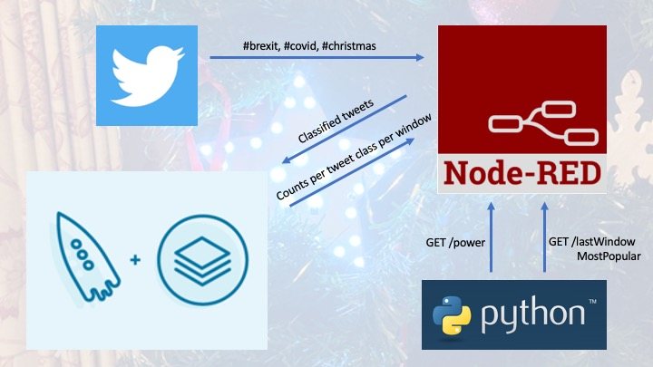

# SentimentStar
I conducted a home project with the goal of gaining useful and demonstrable practical experience in Apache Kafka and ksql for data stream processing - a modern approach to data integration particularly valuable for today's world of high data volumes and continuous streams of events.

#IoT #Kafka #RaspberryPi #Node-RED #StreamProcessing #EventDrivenArchitecture #Cognitive #OpenSource #SentimentAnalysis #RealTime #BigData #MQTT

I built a Node-RED application on a Raspberry Pi using a Twitter developer account to receive and classify tweets on the topics of Brexit, Covid and Christmas in real-time. Having installed the open source Confluent platform, I produced the stream of classified tweets to a Kafka topic. Using ksql within Kafka I aggregated the data to count the messages per class in continuous 30 second windows. I consumed this data from a Kafka topic back into Node-RED and implemented some processing to maintain the most popular topic of the last 30s. I implemented a multi-threaded Python app on a Raspberry Pi to call APIs exposed by Node-RED to retrieve the most popular topic, to control the LED pattern of a connected Christmas Star hung on my Christmas tree. This allows a non-intrusive IoT device - the Star - to be both decorative and an indicator of real-time public sentiment. 

Here's the star: https://thepihut.com/products/raspberry-pi-christmas-tree-star

For a photo of it installed: https://twitter.com/jonmaddison/status/1338543901817311235

For Kafka, I installed the Confluent Platform Community Components edition from https://www.confluent.io/download/ onto my Mac on my home network.  I followed the instructions at https://docs.confluent.io/platform/current/quickstart/cos-quickstart.html.  Once installed, to restart it requires just these three commands
1. `export CONFLUENT_HOME=/path-to-confluent`
2. `export PATH="${CONFLUENT_HOME}/bin:$PATH"`
3. `confluent local services start`

Node-RED and the Python app (code attached) are both running on a local Raspberry Pi Zero - that which is hanging off my Christmas tree with the Star attached.  Its hostname is 'pistar'.

The recommended order of getting these components running is
1. ksql
2. Node-RED, as it produces and consumes the Kafka topics
3. Python, as it calls APIs exposed by Node-RED

## The Node-RED Application
The Node-RED flow is attached.  View the raw content and import it into Node-RED from the clipboard.
- this requries a Twitter account with a developer account (http://developer.twitter.com) to obtain the desired credentials for the Twitter input node.  This uses https://flows.nodered.org/node/node-red-node-twitter  
- the Kafka producer/consumer nodes require the hostname:port of the Kafka cluster e.g. Jons-MacbookPro:9092.  This uses https://flows.nodered.org/node/node-red-contrib-kafka-client
- there is also a test hook in the flow to set the 'power' as 'on' or 'off'.  It needs to be 'on' for the flow of tweet data into Kafka - **by default this is not set so you need to set 'power' to  'on' before the data will flow for the first time**.  I have this operating off an MQTT topic.  I use the Alexa Home Skill Bridge (https://alexa-node-red.bm.hardill.me.uk) on a Node-RED instance running on the IBM Watson IoT Platform - I already had this set up to Alexa-enable a number of other devices.  This lets me say 'Alexa, turn star on/off', and this local flow receives that over MQTT into the 'switch' node at the bottom of the flow.
- when the Twitter input node is enabled, this produces data to a kafka topic called 'nodered, which gets created automatically.  There is also a 'helloworld' test in the flow to confirm Kafka connectivity.
- the flow exposes two global variables through HTTP GET endpoints.  These are called by the Python app.

## The Python Application
The Python source code is also attached.  This has two threads, sharing global variables (probably a lazy way to do it).
- thread 1: polls the Node-RED API running locally to get 'power' and the 'lastWindowMostPopular' tweet topic.
- main thread: sets the star LED pattern based on the most popular topic, or turns lights off on the star if power is 'off'. 

My python app used code from https://github.com/modmypi/Programmable-Christmas-Star as the basis.

## The ksql Application
ksql is an application that comes with Kafka that uses the Kafka Streams API under the covers.  For this project I used ksql from the command line.  First I created the topic from the terminal command line: `kafka-topics --create --bootstrap-server localhost:9092   --replication-factor 1   --partitions 1  --topic nodered`

I then ran `ksql` and needed just two ksql commands - creating a stream and a table, created as persistent queries that run continuously:
- To create a stream representing the 'nodered' topics written to by Node-RED:
ksql> `create stream nodered (tweettime int, tweetclass varchar) with (kafka_topic='nodered', value_format='JSON');`

- To aggregate the data into 30 second windows:
ksql> `create table tweetsperperiod as select tweetclass, count(tweetclass) as count from nodered window tumbling (size 30 seconds) group by tweetclass;`
This creates a tweetsperperiod topic that is consumed back into Node-RED.  Note that every update to this topic is continuously consumed so Node-RED needs to keep track of the highest count per topic, per window.  The 'tumbling' window type means the count resets every 30 seconds, it's not a continuous counnt over any 30 second period.  That would be available using a hopping window - see https://docs.ksqldb.io/en/latest/concepts/time-and-windows-in-ksqldb-queries/#tumbling-window)

- To observe the counts being aggregated within each 30 second window from within Kafka:
ksql> `select * from tweetsperperiod emit changes;`
As with all non-peristent queries, this will run until Ctrl-C is pressed.

As the data is persistent and immutable, for 7 days as the default retention period, other queries can be run over the historical data and in real-time.  e.g. ksql> 
`select tweetclass, count(tweetclass) as count from nodered window tumbling (size 1 day) group by tweetclass emit changes;` for the daily counts.
